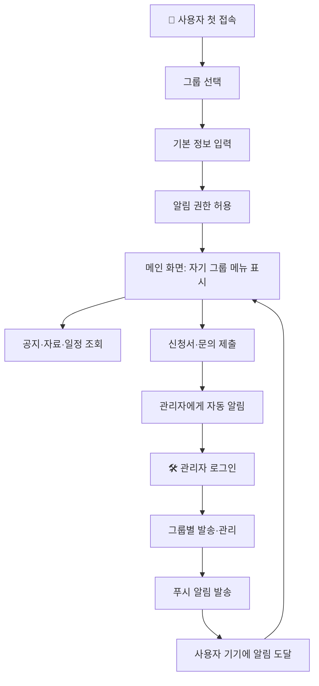

# 📘 사용자 참여형 PWA 시스템 — 운영 흐름 & 구축 가이드

학교·기관·기업에서 **사용자(구성원)와 관리자가 한 앱에서 소통**하는 시스템을 만들 때 참고할 수 있는 가이드.

> **Part 1 (섹션 0~9)**: 시스템이 어떻게 동작하는지 — 흐름과 시나리오
> **Part 2 (섹션 10)**: 실제로 따라 만들 때 어디 가서 뭘 가입하고 어떻게 연결하는지

---

# Part 1 — 시스템 운영 흐름

## 0. 한눈에 보기

```
   👤 사용자                              🛠️ 관리자
   (스마트폰/PC)                          (관리자 페이지)
       │                                       │
       │ 1. 가입 → 그룹 선택                   │ 1. 공지·자료·일정 등록
       │ 2. 그룹 맞춤 정보 받기                │ 2. 그룹 지정 푸시 알림
       │ 3. 푸시 알림 수신                     │ 3. 신청·문의 접수 확인
       │ 4. 신청서·문의 제출                   │ 4. 통계 모니터링
       ▼                                       ▼
   ┌─────────────────────────────────────────────────┐
   │                  중앙 데이터베이스                │
   │  사용자·공지·자료·알림·신청·문의 등 모두 저장      │
   └─────────────────────────────────────────────────┘
                          │
                          ▼
              ┌────────────────────┐
              │  푸시 알림 시스템    │  ← 관리자 발송, 사용자 수신
              └────────────────────┘
```

**한 줄 설명**: 사용자가 자신의 그룹·역할에 맞는 정보만 받고, 관리자가 그룹별로 통제·소통할 수 있는 양방향 모바일 앱.

---

## 1. 두 관점

### 👤 사용자 입장에서 할 수 있는 일

| 기능 | 설명 |
|---|---|
| 가입 | 자기가 어느 그룹(예: 재학생·졸업생·전담인력 등) 인지 선택 후 기본 정보 입력 |
| 푸시 알림 받기 | 본인 그룹에게 가는 알림만 수신 (다른 그룹 알림은 안 옴) |
| 공지사항 보기 | 자기 그룹 대상 공지만 보임 |
| 자료실 접근 | 자기 그룹용 자료만 다운로드 가능 |
| 일정 캘린더 | 학사 일정·시험·행사 등 확인 |
| 신청서 제출 | 온라인 폼으로 신청 (한 번만 가능, 마감 전까지 수정 가능) |
| 1:1 문의 | 관리자와 비공개 채팅처럼 문의 |
| 익명 의견 보내기 | 신원 노출 없이 의견·건의 |
| 알림 히스토리 | 종(🔔) 아이콘으로 지금까지 받은 알림·공지·자료 한눈에 |

### 🛠️ 관리자 입장에서 할 수 있는 일

| 기능 | 설명 |
|---|---|
| 가입자 관리 | 그룹별 사용자 목록·통계, 휴지통(소프트 삭제) |
| 공지 발행 | 대상 그룹 지정 + 핀 고정 + 예약 발송 가능 |
| 자료 업로드 | 카테고리별로 PDF/이미지 자료 업로드, 그룹별 접근 통제 |
| 푸시 알림 발송 | 그룹 지정 + 즉시/예약 발송 |
| 신청서 검토 | 들어온 신청 목록 조회, CSV로 다운로드 |
| 상담·문의 답변 | 사용자 문의에 답변 |
| 만족도 조사 | 설문 만들고 응답 통계 보기 |
| 캘린더 관리 | 학사/행사 일정 추가·수정 |
| 활동 로그 | 누가 언제 무엇을 했는지 감사 로그 |
| 통계 대시보드 | 가입자 추이·알림 발송 통계 한눈에 |

---

## 2. 시스템 전체 흐름



---

## 3. 핵심 기능별 운영 흐름

### 3-1. 가입 + 알림 권한 등록 흐름

```
사용자: 앱 첫 진입
   ↓
사용자: 카테고리 선택 ("나는 재학생/졸업생/...")
   ↓
사용자: 기본 정보 입력 (이름·연락처·소속 등)
   ↓
시스템: 기기에 고유 ID(deviceId) 자동 생성
   ↓
시스템: 알림 권한 요청 → 사용자가 "허용" 클릭
   ↓
시스템: 알림 시스템에서 그 기기 전용 ID(oneSignalId) 발급
   ↓
시스템: 사용자 정보 + deviceId + oneSignalId 한 묶음으로 DB 저장
   ↓
사용자: 메인 화면 진입 (자기 그룹 맞춤 메뉴)
```

**왜 이 구조?**
- `deviceId`로 같은 기기는 항상 같은 사람으로 인식 (덮어쓰기 처리)
- `oneSignalId`로 그 사람에게 푸시 알림 보낼 수 있음
- 그룹 정보가 있어야 나중에 "재학생만" 같은 필터링 가능

### 3-2. 푸시 알림 발송 흐름

```
관리자: 관리자 페이지 진입 → 비밀번호 인증
   ↓
관리자: "알림" 탭 → 대상 그룹 선택 + 제목·내용 작성
   ↓
관리자: "발송" 또는 "예약 발송" 클릭
   ↓
시스템: DB에서 대상 그룹 사용자의 oneSignalId 목록 추출
   ↓
시스템: 알림 발송 서비스로 ID 목록 + 메시지 전달
   ↓
알림 서비스: 각 기기에 푸시 전송
   ↓
사용자: 스마트폰 알림창에 알림 표시
   ↓
사용자: 알림 누르면 앱(특정 페이지)으로 진입
   ↓
앱 안 종(🔔) 아이콘에도 새 알림 표시됨
```

**핵심**: 알림 내용이 두 곳에 저장됨
1. 알림 발송 서비스 (실제 푸시 전달)
2. 자체 DB의 `notifications` 컬렉션 (앱 안에서 다시 볼 수 있게)

### 3-3. 공지사항 운영 흐름

```
관리자                              사용자
   │                                  │
   │ 1. 공지 작성                     │
   │    (제목·내용·대상 그룹·핀고정)   │
   │                                  │
   │ 2. 등록                          │
   │ ──→ DB의 notices 컬렉션 저장      │
   │                                  │
   │                                  │ 3. 공지사항 메뉴 진입
   │                                  │ ←── 자기 그룹용 공지만 필터링
   │                                  │                                  │ 4. 핀 고정 공지 → 상단 표시
   │                                  │ 5. 일반 공지 → 시간 역순 표시
```

### 3-4. 자료실 운영 흐름

```
[관리자 자료 업로드]
관리자: 카테고리 선택 → 파일 + 대상 그룹 지정
   ↓
시스템: 파일은 GitHub 저장소 또는 외부 호스팅
   ↓
시스템: 메타데이터(제목·URL·target·카테고리)를 DB 저장

[사용자 자료 조회]
사용자: 자료실 메뉴 진입
   ↓
시스템: 사용자 그룹과 매칭되는 자료만 필터링
   ↓
사용자: 카테고리·서브카테고리로 탐색 → 다운로드
```

### 3-5. 신청 접수 흐름

```
사용자                              시스템                          관리자
   │ 1. "신청서" 메뉴                 │                              │
   │ 2. 기본 정보 입력 (자동 채움)     │                              │
   │ 3. 희망사항 입력 (자유 작성)      │                              │
   │ 4. 제출                          │                              │
   │ ───────→ 한 명 = 한 신청서       │                              │
   │          재제출 시 덮어씀         │                              │
   │                                  │ → 관리자에게 자동 푸시         │
   │                                  │ ─────────────────────────→  │ 5. "새 신청서" 알림 수신
   │                                  │                              │ 6. 신청 목록 확인
   │                                  │                              │ 7. CSV 다운로드 → 엑셀
```

### 3-6. 1:1 문의·상담 흐름

```
사용자: "문의" 메뉴 → 문의 작성·전송
   ↓
시스템: DB의 consulting 컬렉션에 저장
   ↓
관리자: 상담 탭에서 새 문의 확인 → 답변 입력
   ↓
사용자: 본인 문의 페이지에서 답변 확인
```

### 3-7. 익명 의견함 흐름

```
사용자: "익명 의견" 메뉴 → 의견 작성 (이름·연락처 안 받음)
   ↓
시스템: feedback 컬렉션에 저장 (식별자 없음)
   ↓
관리자: 의견함 탭에서 시간순으로 조회
```

### 3-8. 알림 종(🔔) 위젯 — 통합 히스토리

```
사용자: 어느 페이지든 우측 상단 종 아이콘 표시
   ↓
종 누르면 30일 이내 세 가지 통합 표시
   ┌─ 공지사항
   ├─ 새 자료
   └─ 푸시 알림
   ↓
사용자 그룹 매칭된 것만 + 시간순 정렬
   ↓
항목 클릭 → 해당 페이지 이동
   ↓
"마지막 본 시각" 저장 → 다음에 새 알림 빨간 배지
```

---

## 4. 데이터 흐름·권한

### 누가 무엇에 접근할 수 있는가

| 컬렉션 | 사용자 읽기 | 사용자 쓰기 | 관리자 |
|---|---|---|---|
| 사용자 정보 | 본인 것만 | 본인 것만 | 전체 |
| 공지사항 | 본인 그룹만 | ❌ | 전체 |
| 자료실 | 본인 그룹만 | ❌ | 전체 |
| 알림 히스토리 | 본인 그룹만 | ❌ | 전체 |
| 신청서 | 본인 것만 | 본인 것만 | 전체 |
| 문의 | 본인 것만 | 본인 것만 | 전체·답변 |
| 익명 의견 | ❌ | 가능 (식별 X) | 전체 |
| 관리자 로그 | ❌ | ❌ | 전체 |

### 그룹별 필터링은 어떻게?

각 데이터에 `target` 필드를 두고 사용자 그룹과 매칭:
- `target = 'all'` → 모든 그룹
- `target = 'student'` → 재학생 그룹에게만
- `target = 'company'` → 전담인력 그룹에게만

---

## 5. 관리자가 평소에 하는 일

| 빈도 | 작업 | 도구 |
|---|---|---|
| 매일 | 새 가입자·문의·신청 확인 | 가입자/상담/신청 탭 |
| 주 1회 | 공지·자료·푸시 알림 | 알림/공지/자료실 탭 |
| 월 1회 | 가입자 추이·알림 도달률 | 통계 대시보드 |
| 필요시 | 만족도 조사·캘린더·휴지통 | 각 탭 |
| 자동 | 데이터 백업 | 백업 자동화 |

### 알림 발송 시 주의

- **무료 알림 서비스 월 한도** (예: 10,000건): 1만 명에 1번 보내면 다 소모. 정말 필요할 때만 전체 발송
- **iOS 제약**: "홈 화면에 추가"로 PWA 설치한 경우에만 푸시 받음 (일반 사파리 X)
- **카카오톡 인앱 브라우저**: 푸시 안 됨 → 일반 브라우저로 이동시켜야 함

---

## 6. 🏢 기업 인사부 응용 시나리오 매핑

| 학교 운영용 | 기업 인사부 응용 |
|---|---|
| 재학생 / 졸업생 / 예비신입생 / 전담인력 | 정규직 / 계약직 / 신입사원 / 협력사 / 인사담당자 |
| 학과별 공지 | 부서별·직급별 공지 |
| 자료실 (학습 자료) | 사내 자료실 (취업규칙·복지·교육자료) |
| 학사 일정 캘린더 | 사내 이벤트·교육·휴가 일정 |
| 신청 접수 (일학습병행) | 교육·복지·휴가·승진 추천 신청 |
| 1:1 상담 (학습 상담) | 인사 상담·고충 처리 |
| 익명 의견함 | 사내 익명 제보·개선 제안 |
| 만족도 조사 | 직원·복지·교육 만족도 |
| 모의시험 | 사내 자격증 시험·교육 평가 |
| 알림 종(🔔) | 사내 공지·인사 발령·교육 알림 통합 |

### 응용 예: "사내 교육 신청"

```
[설정] 관리자: "교육" 카테고리 + 대상 그룹("신입사원") + 정원 등록

[직원 신청]
직원: "사내 교육 신청" 메뉴 → 본인 그룹용 교육만 표시
직원: 교육 선택 → 신청 폼 작성 (사번·이름 자동 채움)
직원: 제출 → 인사담당자에게 자동 푸시

[관리자 처리]
인사담당자: 신청 목록 → CSV 다운로드 → 엑셀에서 검토
인사담당자: 선발 결과를 푸시 알림으로 발송 (선발된 사람에만)
```

### 응용 시 추가로 필요할 수 있는 것

- **사번/SSO 연동**: 회사 SSO(Single Sign-On) 또는 사번 기반 인증
- **부서·직급 계층 구조**: 평탄한 5개 그룹 대신 다층 트리
- **결재 워크플로**: 1차 승인 → 2차 승인 → 최종
- **개인정보 보호 규제**: GDPR·국내 개인정보보호법 대응

---

## 7. 운영하면서 알게 된 노하우

### 가장 자주 발생하는 문제

1. **캐시 문제** — 코드 업데이트했는데 옛 버전 보임
   - 해결: 캐시 방지 헤더 + URL에 `?v=시간` 버전 쿼리
2. **iOS 푸시 안 옴** — 사파리는 불가
   - 해결: "홈 화면에 추가"로 PWA 설치 안내
3. **카카오톡 인앱 브라우저 문제**
   - 해결: 진입 시 일반 브라우저로 자동 redirect
4. **알림 안 옴 문의**
   - 해결: "알림 진단" 페이지로 사용자가 자가 점검

### 운영 효율 팁

- **그룹 자동 분리**: 가입 시 그룹 선택 → 이후 모든 콘텐츠 자동 필터
- **CSV 다운로드 기본**: 신청·문의·만족도 엑셀 후속 처리용
- **활동 로그**: 누가 언제 무엇을 했는지 자동 기록
- **소프트 삭제(휴지통)**: 실수 복구 가능, 영구 삭제 대신 `deleted: true` 플래그

---

## 8. 한 페이지 요약

> **사용자가 자기 그룹에 맞는 정보만 받고, 관리자가 그룹별로 통제·소통하는 양방향 모바일 앱**
>
> 핵심 데이터: 사용자 정보(그룹 포함) → 그룹 단위로 공지·자료·알림 발송 → 사용자는 자기 그룹용 콘텐츠만 보임
>
> 사용자 흐름: **가입 → 그룹 맞춤 메뉴 → 알림 수신 → 신청·문의 제출**
>
> 관리자 흐름: **로그인 → 그룹별 발송 → 접수된 데이터 확인 → CSV로 후속 처리**

---

## 9. 자체 시스템 구축할 때 검토 사항

| 단계 | 결정할 것 |
|---|---|
| 1. 사용자 그룹 정의 | 우리 조직 사용자를 어떻게 나눌까? (부서·직급·직무) |
| 2. 가입 정보 항목 | 어떤 정보 받을까? (필수·선택 구분) |
| 3. 인증 방식 | 자유 가입 / 사번 / SSO / 초대 코드? |
| 4. 콘텐츠 종류 | 공지·자료·일정·신청·문의·설문 중 무엇? |
| 5. 알림 정책 | 누가 어떤 알림을 보낼 수 있나? 빈도 제한? |
| 6. 권한 통제 | 사용자가 다른 사람 데이터 못 보게 어떻게? |
| 7. 보안 규제 | 개인정보 처리방침·보관 기간·접근 로그 |
| 8. 모바일 환경 | 안드로이드만? iOS도? PWA vs 네이티브? |
| 9. 운영 인력 | 관리자 페이지를 몇 명이 어떻게 운영? |
| 10. 백업·재해 복구 | 데이터 백업·장애 복구 어떻게? |

---

# Part 2 — 실제로 구축할 때 따라할 단계

여기부터는 **시스템을 직접 만들 때 어떤 외부 서비스에 가입하고 어떻게 연결하는지** 실제 순서. 위의 결정 사항이 정리됐다는 가정.

## 10. 가입 + 설정 단계 (순서대로)

### 🅰️ 단계 1. **GitHub** — 코드 보관소 + 무료 호스팅

**왜 필요?**: 코드를 보관하고 자동으로 웹사이트로 띄워줌 (호스팅 비용 0원).

**가입 + 설정**
1. https://github.com 접속 → **"Sign up"** 클릭
2. 이메일·비밀번호·아이디 입력 (아이디는 곧 사이트 주소가 됨)
3. 로그인 후 우측 상단 **`+` → "New repository"**
4. 저장소 만들기:
   - **이름**: `<유저명>.github.io` (정확히 이 형식 — 예: `mycompany.github.io`)
   - **Public** 선택
   - "Initialize with README" 체크
   - "Create repository" 클릭
5. 좌측 메뉴 **Settings → Pages**
6. **Source**: `Deploy from a branch`, **Branch**: `main`, 폴더: `/(root)` → **Save**
7. 1~2분 후 `https://<유저명>.github.io/` 주소가 살아남

✅ **결과**: 호스팅 주소 1개
💰 **비용**: 무료
⏱️ **소요**: 10분

---

### 🅱️ 단계 2. **Firebase** — 데이터베이스

**왜 필요?**: 사용자·공지·자료·신청서 등 모든 데이터를 저장하는 클라우드 DB.

**가입 + 설정**
1. https://console.firebase.google.com 접속 → **구글 계정으로 로그인**
2. **"프로젝트 만들기"** → 프로젝트 이름 입력 (예: `mycompany-app`)
3. Google Analytics는 "사용 안 함"으로 시작 (나중에 켜도 됨)
4. 프로젝트 생성 완료 (1~2분)
5. 좌측 메뉴 **"Build" → "Firestore Database"** → **"데이터베이스 만들기"**
6. **모드 선택**: 일단 **"테스트 모드"** (30일간 누구나 접근 — 개발용)
7. **위치**: `asia-northeast3 (서울)` 또는 가까운 지역
8. 좌측 톱니바퀴 **⚙️ → "프로젝트 설정" → 일반 탭**
9. 아래로 스크롤 → **"앱 추가" → 웹 아이콘(</>)** 클릭
10. 앱 이름 입력 → "Firebase Hosting" 체크 **안 함** → "앱 등록"
11. **나오는 코드 블록의 `firebaseConfig` 객체 복사**해서 메모장에 보관:
   ```javascript
   const firebaseConfig = {
     apiKey: "AIza...",
     authDomain: "mycompany-app.firebaseapp.com",
     projectId: "mycompany-app",
     // ...
   };
   ```

⚠️ **운영 전 필수**: 보안 규칙을 반드시 강화 (테스트 모드는 누구나 접근 가능)

✅ **결과**: `firebaseConfig` 객체 (코드에 붙여넣을 것)
💰 **비용**: 무료 한도 — 50,000 읽기/일, 20,000 쓰기/일
⏱️ **소요**: 10분

---

### 🅲 단계 3. **OneSignal** — 푸시 알림

**왜 필요?**: 사용자 스마트폰에 알림을 보낼 수 있게 해줌. iOS·Android·PC 모두 지원.

**가입 + 설정**
1. https://onesignal.com 접속 → **"Sign Up"** (구글/깃허브로 로그인 가능)
2. 로그인 후 **"New App/Website"** 클릭
3. 앱 이름 입력 (예: "회사명 사내 알림")
4. **"Web"** 선택 (모바일 앱이 아니라 웹 앱)
5. **Setup 화면에서**:
   - **Site Name**: 회사명
   - **Site URL**: `https://<유저명>.github.io` (1단계에서 만든 주소)
   - **Default Icon URL**: 회사 로고 URL (선택, 알림에 표시될 작은 아이콘)
   - **Auto Resubscribe**: ON
6. **Save** 클릭
7. **"Download OneSignal SDK Files"** 클릭 → ZIP 다운로드
   - 안에 들어있는 **`OneSignalSDKWorker.js`** 파일을 GitHub 저장소 루트에 업로드 (직접 끌어다 놓기 가능)
8. **발급 키 두 가지 받기**:
   - 좌측 메뉴 **Settings → Keys & IDs**
   - **OneSignal App ID** 복사 (클라이언트 코드용 — 공개해도 OK)
   - **REST API Key** 복사 (서버용 — 절대 공개 X)

✅ **결과**: App ID + REST API Key + Worker 파일
💰 **비용**: 무료 한도 — 월 10,000 메시지, 무제한 구독자
⚠️ **iOS 제약**: 사파리는 PWA 설치 후에만 알림 받음 (OS 제약)
⏱️ **소요**: 15분

---

### 🅳 단계 4. **Cloudflare Workers** — API 키 보호용 (선택이지만 권장)

**왜 필요?**: OneSignal REST API Key를 클라이언트에 박으면 누구나 그 키로 알림을 보낼 수 있음. Cloudflare Worker가 키를 안전하게 보관하고 클라이언트는 Worker만 호출하게 함.

**가입 + 설정**
1. https://workers.cloudflare.com 접속 → 가입 (이메일·비밀번호)
2. **"Create a Worker"** 클릭 → 이름 입력 (예: `mycompany-notif`)
3. 코드 화면에서 기본 코드를 지우고 아래 붙여넣기:

```javascript
export default {
  async fetch(request, env) {
    if (request.method === 'OPTIONS') {
      return new Response(null, {
        headers: {
          'Access-Control-Allow-Origin': '*',
          'Access-Control-Allow-Methods': 'POST, OPTIONS',
          'Access-Control-Allow-Headers': 'Content-Type'
        }
      });
    }
    if (request.method !== 'POST') return new Response('Method not allowed', { status: 405 });
    const body = await request.json();
    const res = await fetch('https://onesignal.com/api/v1/notifications', {
      method: 'POST',
      headers: {
        'Content-Type': 'application/json',
        'Authorization': `Basic ${env.ONESIGNAL_REST_API_KEY}`
      },
      body: JSON.stringify(body)
    });
    const data = await res.json();
    return new Response(JSON.stringify(data), {
      headers: {
        'Content-Type': 'application/json',
        'Access-Control-Allow-Origin': '*'
      }
    });
  }
};
```

4. **"Save and Deploy"** 클릭
5. 배포 완료 후 Worker URL 메모 (예: `https://mycompany-notif.your-name.workers.dev`)
6. 좌측 **Settings → Variables → "Add variable"**:
   - 이름: `ONESIGNAL_REST_API_KEY`
   - 값: 3단계에서 받은 OneSignal REST API Key
   - **"Encrypt"** 체크 (중요!)
   - Save

✅ **결과**: Worker URL (클라이언트 코드의 `WORKER_URL`에 사용)
💰 **비용**: 무료 한도 — 100,000 요청/일
⏱️ **소요**: 15분

---

### 🅴 단계 5. **(선택) Cloudinary** — 이미지 호스팅

**왜 필요?**: 자료실에 PDF·이미지 많이 올리면 GitHub 저장소가 무거워짐. Cloudinary가 무료 미디어 호스팅 제공.

**가입 + 설정**
1. https://cloudinary.com 접속 → 가입
2. Dashboard에서 **Cloud Name** 확인 (예: `dfu06qits`)
3. **Settings → Upload → "Upload presets" → "Add upload preset"**
4. Preset 설정:
   - **Preset name**: `mycompany_uploads`
   - **Signing Mode**: **Unsigned** (클라이언트에서 직접 업로드 가능)
   - Save

✅ **결과**: Cloud Name + Preset Name
💰 **비용**: 무료 한도 — 월 25GB 트래픽, 25,000 변환
⏱️ **소요**: 10분

---

### 🅵 단계 6. 키들을 코드에 연결

위에서 받은 값들을 HTML 파일 안에 붙여넣기:

```javascript
// Firebase (단계 2에서 받은 객체)
const FB_CFG = {
  apiKey: "AIza...",
  authDomain: "mycompany-app.firebaseapp.com",
  projectId: "mycompany-app",
  // ...
};

// OneSignal (단계 3에서 받은 App ID)
const APP_ID = "abc12345-...";

// Worker URL (단계 4에서 만든 URL)
const WORKER_URL = "https://mycompany-notif.your-name.workers.dev";

// Cloudinary (단계 5에서 만든 값들 - 사용 시)
const CLOUDINARY_CLOUD = "dfu06qits";
const CLOUDINARY_PRESET = "mycompany_uploads";
```

---

### 🅶 단계 7. GitHub에 코드 푸시

방법 두 가지:

**방법 A — 브라우저로 직접 업로드** (간단)
1. GitHub 저장소 페이지 → "Add file → Upload files"
2. HTML 파일들 드래그·드롭
3. 하단 "Commit changes"

**방법 B — Git 명령어로** (개발자용)
```bash
git clone https://github.com/유저명/유저명.github.io.git
cd 유저명.github.io
# 파일 복사
git add .
git commit -m "초기 코드"
git push
```

1~3분 후 `https://유저명.github.io/` 에 반영됨.

---

### 🅷 단계 8. 첫 테스트

1. 본인 폰에서 `https://유저명.github.io/` 접속
2. **가입** → 그룹 선택 → 정보 입력 → **알림 권한 허용**
3. Firebase 콘솔 → Firestore → `users` 컬렉션에 본인 데이터 들어갔는지 확인
4. 관리자 페이지 진입 → 비밀번호 입력
5. **알림 발송 테스트** → 본인 폰에 도착하는지 확인
6. 문제 있으면 8-1 → 8-2 → ... 단계별로 어디서 막혔는지 점검

---

## 11. 가입한 서비스 한눈에 정리

| 서비스 | 용도 | 받는 키·값 | 무료 한도 |
|---|---|---|---|
| 🅰️ GitHub | 코드 보관 + 호스팅 | 저장소 주소 (`<유저명>.github.io`) | 무제한 |
| 🅱️ Firebase | 데이터베이스 | `firebaseConfig` 객체 | 50K 읽기/일 |
| 🅲 OneSignal | 푸시 알림 | App ID + REST API Key + Worker.js | 월 10K 메시지 |
| 🅳 Cloudflare Workers | API 키 보호 | Worker URL | 100K 요청/일 |
| 🅴 Cloudinary | (선택) 이미지 호스팅 | Cloud Name + Preset | 월 25GB |

**전체 가입 시간**: 약 1시간
**월 운영비**: 0원 (소규모 운영 기준)

---

## 12. 만약 막힌다면

각 서비스마다 풍부한 한국어 문서·튜토리얼이 있어. 막히는 부분 키워드로 검색하면 거의 답이 나옴:

- Firebase: "Firebase Firestore 시작하기"
- OneSignal: "OneSignal Web Push 한국어 가이드"
- Cloudflare Workers: "Cloudflare Worker 시작하기"
- GitHub Pages: "GitHub Pages 사용법"

ChatGPT·Claude에 **"내가 OneSignal App ID는 받았는데 이걸 HTML 코드 어디에 넣어야 해?"** 처럼 구체적으로 질문하면 잘 알려줘.

---

**이 가이드 자유롭게 가져다 활용.** 처음 만드는 거라면 8단계 첫 테스트까지 한 번 돌려보고, 그 다음 자기 조직에 맞게 기능을 하나씩 추가하는 식으로 가는 게 가장 빠름.
